[中文测评点此处](README_CN.md)

# LaserPecker L1 & L1 Pro Review
I am a happy owner of both LaserPecker L1 and L1 Pro. Here I share some of my thoughts and uses of them. I'll refer to L1 Pro as Pro for short in the rest of the artical.

# LaserPecker
LaserPecker is brand of affordable and portable cunsumer level laser engravers. So far they have released their first generation laser engraveers (L1 and L1 Pro). The company will release more models with more powerful capabilities in 2020 and the near future.

For more details, visit their official [English site](https://www.laserpecker.net/) or [Chinese site](http://www.laserpecker.cn/).

# L1 vs L1 Pro Comparison

## The Look

## Key Specifications

|  | L1 | L1 Pro |
| ------ | ------ | ------ |
| Laser | 450nm Blue, 1600mW | 405nm Blue-Violet, 500mW (equivalent to 1500mW Blue laser) |
| Pixel Size | 0.3mm (or smaller\*)| 0.15mm |
| Engrave Range|100mm x 100mm (200m x 140mm\**)| 100mm x 100mm (106mm x 106mm\*\*\*)|

\* Can be improved with an easy modification, but engraving range will reduce as a trade-off. Read on.

\*\* With Gcode. Read on.

\*\*\* With Gcode, but the improvement is so small that it's not worth the trouble.

# L1

To be updated...

# Pro

## Unpacking Pro Deluxe Edition

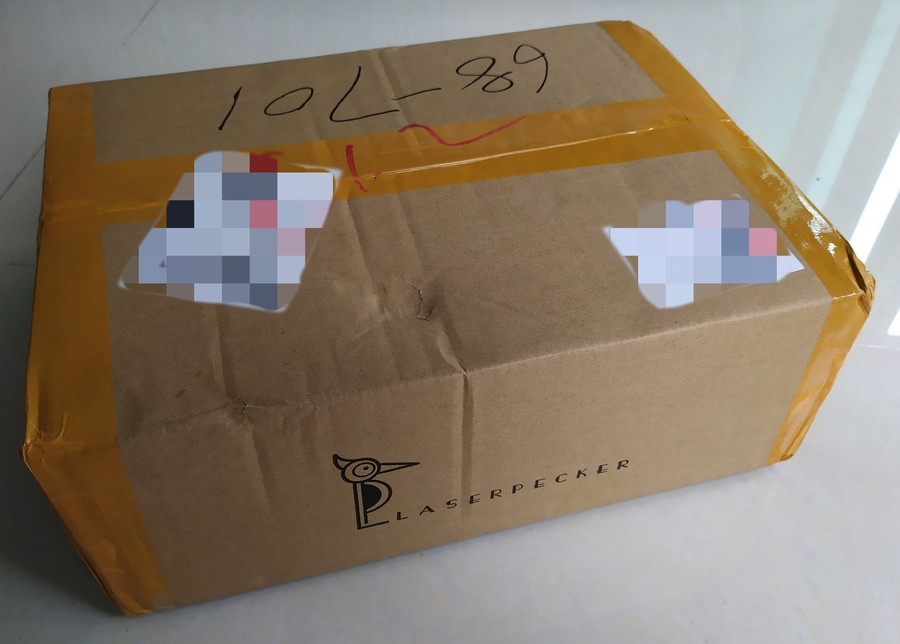
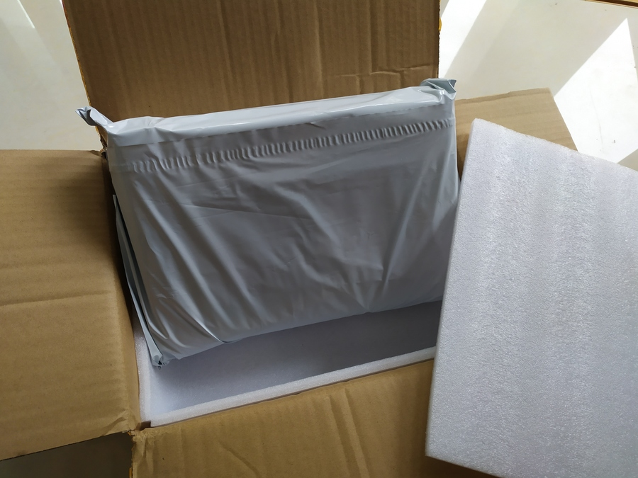

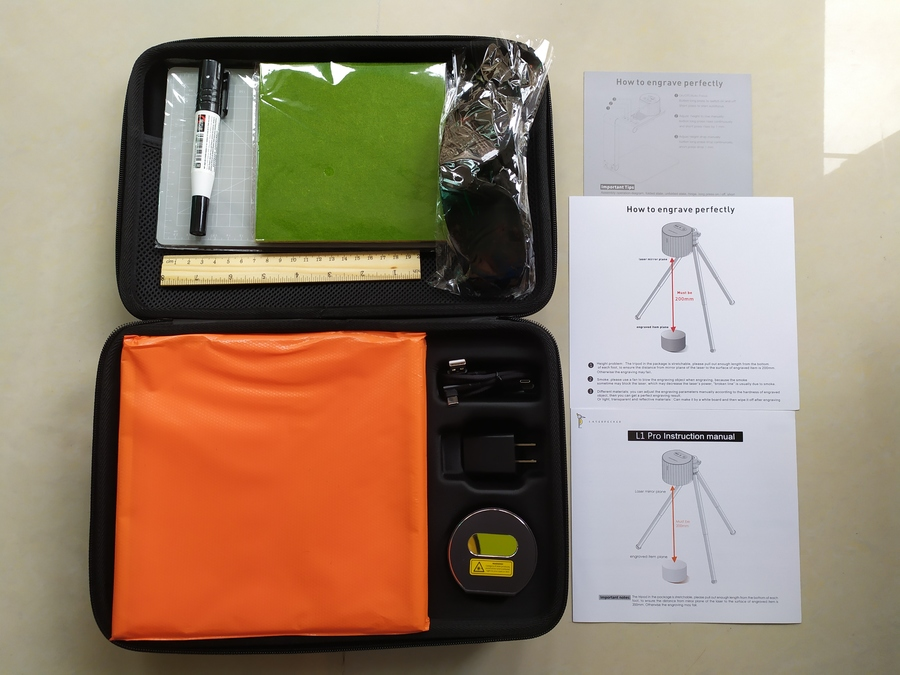

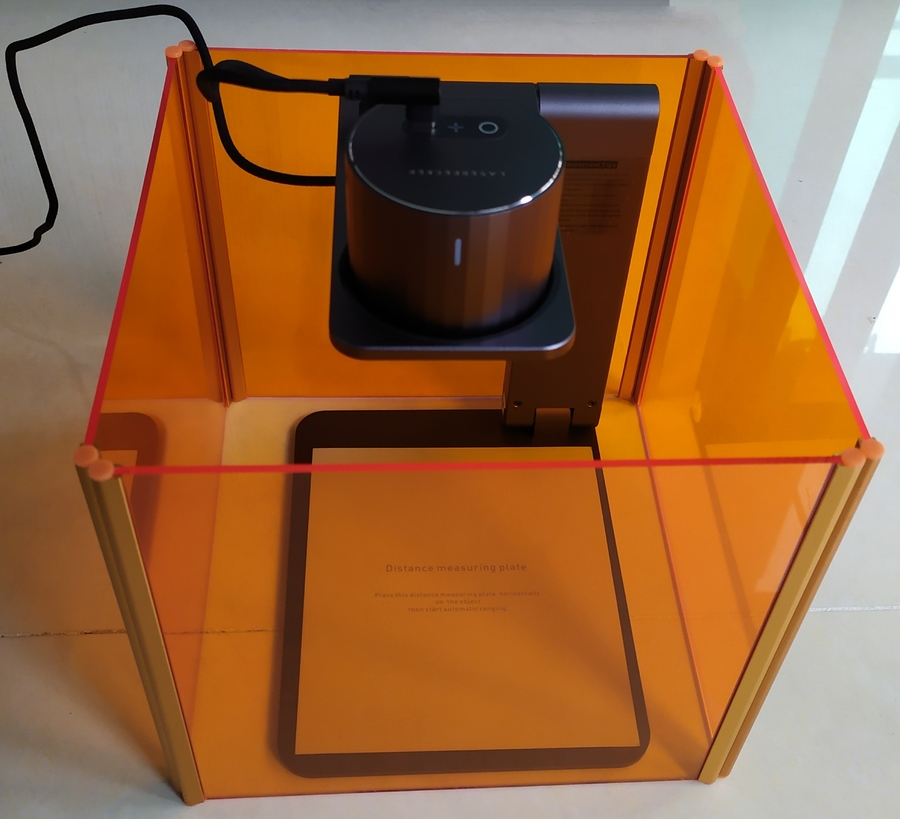

**What came in the Deluxe Edition**:
* Laser engraver
* USB power adapter (5V2A)
* A pair of protective Goggles
* Engraving material pack
* A 20cm ruler
* A black whiteboard marker
* A cutting mat
* USB Cables (1 long, 1 short)
* A small foldable tripod
* Automatic stand
* 4 pieces of magnetic protective shields
* A hard carry case

## LaserPecker App

Controlling the engraver is done via LaserPecker App and bluetooth over your smartphone. I do wish there's a desktop (Linux particularly) client or API available, as I'm a big fan of automation via scripting.

Don't be put off by the low rating of the App in Play Store or App Store. It isn't perfect, but it's improving and updating frequently.

## Power Consumption & Heat Dissipation

## Speed & Configuration

## Accuracy Test

## Manipulation via Gcode

### Gray Scale & Cutting

## Working with Different Materials

Throughout my article, I will use the notation of (P,D)xT to indicate the engraving configuration, where P is power, D is depth and T is times of engraving. I will omit x1 time, so (100,80)x1 becomes (100,80), meaning power:100, depth:80, once. (50,20)x2 means power:50, depth:20, 2 times. (30,50)x3 means power:30, depth:50, 3 times.

Remember, the engraving configurations for different materials in the App are only recommended values. Apart from material, colour, density and even room temperature will have some impact on the result. So I suggest you either do some test engraving before your "big job", or start with low power, shallow burns and work your way up to avoid over burning your material.

Sometimes, multiple low power shallow burns are better than one hig power deep burn. For example, I prefer using 80,50 x2 times in Gcode mode to cut PVC stickers, rather than using 100,80 to cut once. The edges are much better (less burnt).

The bottom lines is, there's no perfect setting for a class of materials. Don't get frustrated or upset when you fail to achieve what you wanted in one go. The more you play with your LaserPecker, the better you will know its capabilities and performance on different materials. Do take notes of the perfect configurations that you have tested out for specific materials which you frequently use.

### Wood
Wood is one of the most easy & satisfying materials to engrave. Darker wood grain is harder to burn in, while lighter wood grain can be engraved with lower power. So, for relatively consistent result, I suggest you over-burn a little. For this dark wood of mine, I used (100,80). Again, don't just take my settings. Do some test burns by yourself and find the best setting for your material.

**Tip**: If the first go leaves an uneven result. Do not touch your material and do a 2nd burn over it with the same or higher setting.

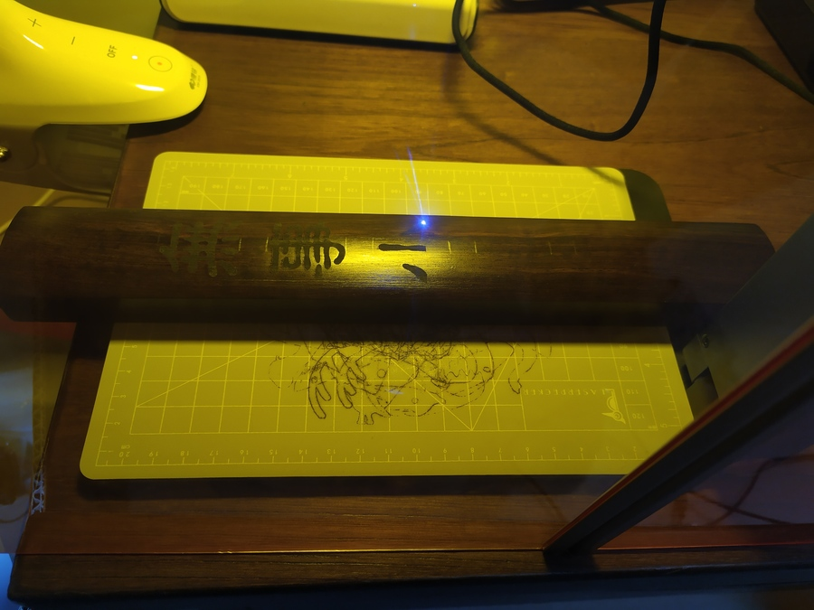
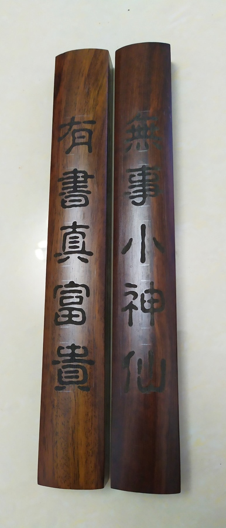

### Cardboard

### Plastic

### Fabric

### Coloured Paper

### Felt Paper
I have cut these for my son to play with. I used (80,60)x2 for a clean cut that's reasonably easy to remove. Occasionally, I had to use utility knife to cut part of the shape off.

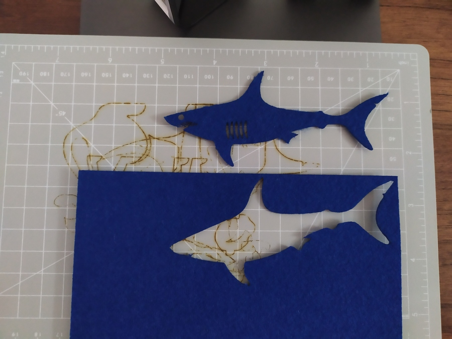

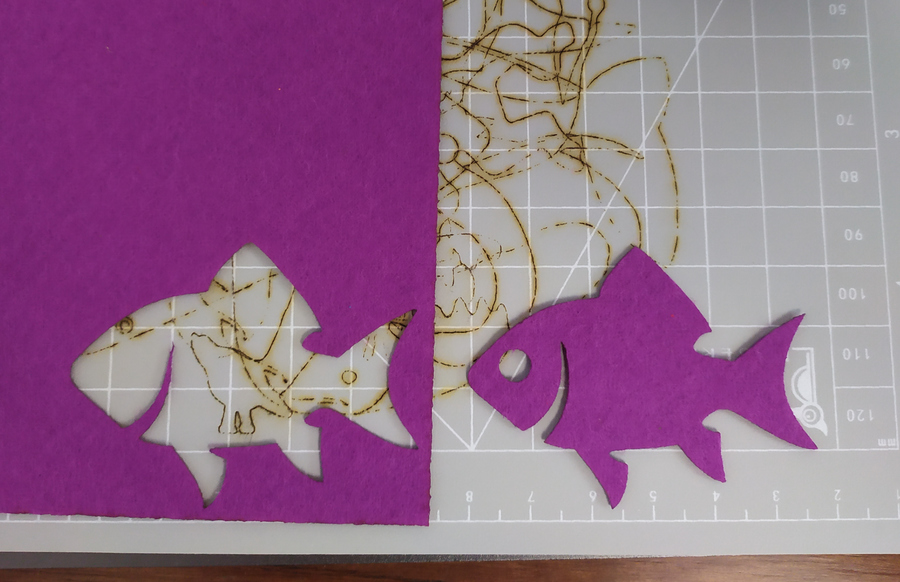
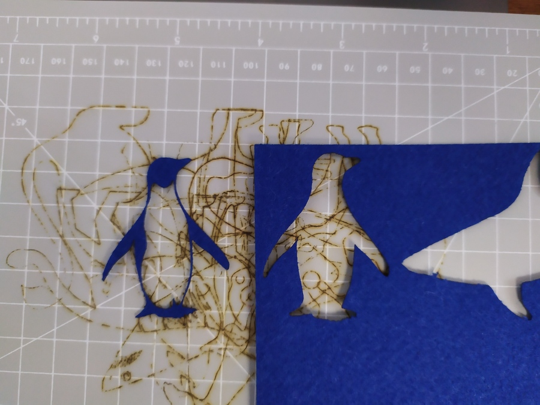
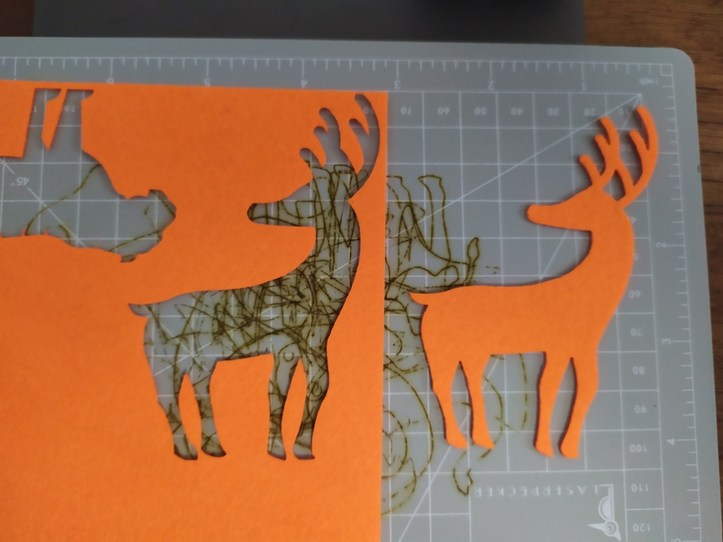

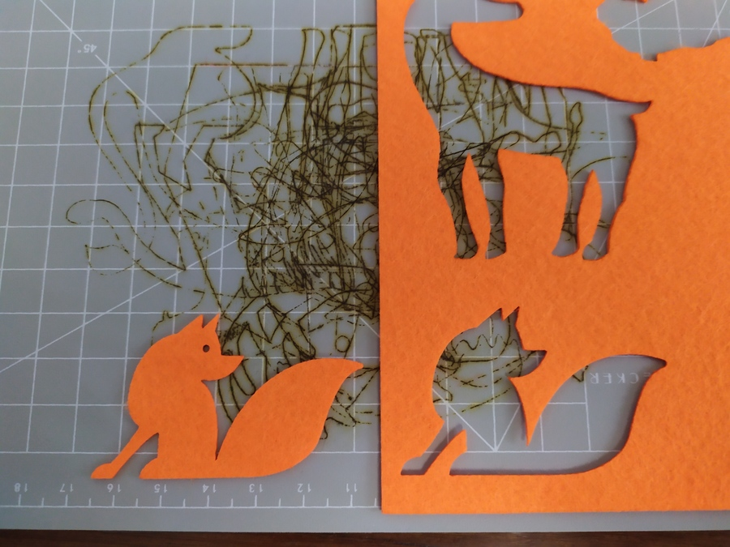

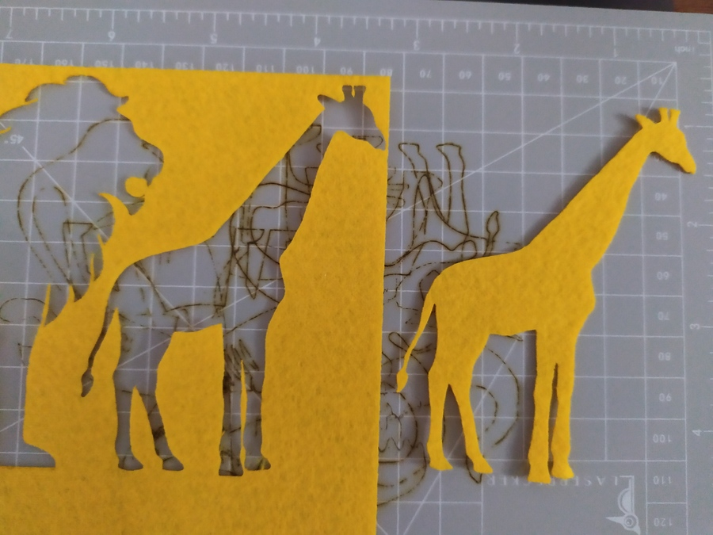
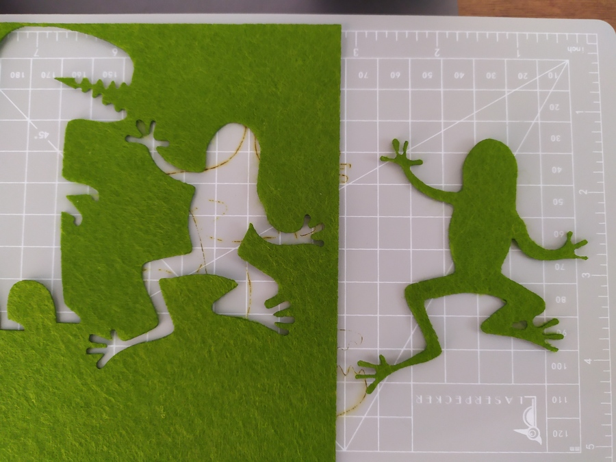

### Photosensitive Stamp

# Automatic Stand

The automatic stand was released with the Pro model. It is compatible with L1 and can be purchased separately.
