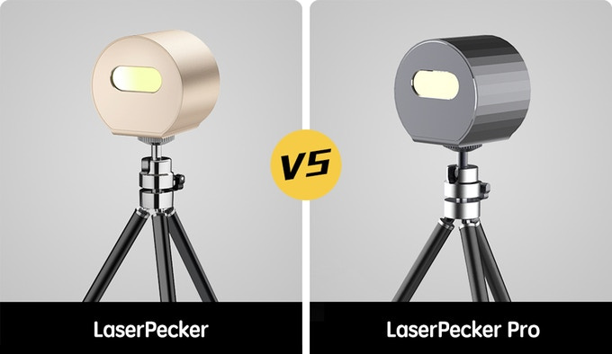

# LaserPecker L1 & L1 Pro Review
I am a happy owner of both LaserPecker L1 and L1 Pro. Here I share some of my thoughts and uses of them. I may refer to L1 Pro as Pro for short in the rest of the article.

# LaserPecker
LaserPecker is brand of affordable and portable consumer level laser engravers. So far they have released their first generation laser engravers (L1 and L1 Pro). The company will release more models with more powerful capabilities in 2020 and the near future.

For more details, visit their official [English site](https://www.laserpecker.net/) or [Chinese site](http://www.laserpecker.cn/).

# L1 vs L1 Pro

## The Look
L1 and Pro are of the same size & design, with minor difference as shown below. Therefore both will fit onto the automatic stand. 

## Key Specifications

|  | L1 | L1 Pro |
| ------ | ------ | ------ |
| Laser | 450nm Blue, 1600mW | 405nm Blue-Violet, 500mW (equivalent to 1500mW) |
| Pixel Size | 0.3mm (or smaller\*) | 0.15mm |
| Engrave Range|100mm x 100mm | 100mm x 100mm |

\* Can be improved with an easy modification, but engraving range will reduce as a trade-off. Read on.

# [L1 Review](L1_EN.md)

# [L1 Pro Review](Pro_EN.md)

# [Automatic Stand](Auto_Stand_EN.md)

# Modifications

* [Kick-ass mod to improve L1 accuracy and power](https://github.com/yy502/laserpecker-review/blob/master/L1_EN.md#kick-ass-modification-cheap--cheerful)
* [Laser guide add-on to assist alignment for both L1 and L1 Pro]()
* [Flip adaptor for auto-stand]()
* [4-way placement extension for auto-stand]()

# Speed Comparison

Due to Pro's increased precision, it takes up to **four** times long to engrave the same amount of pixels. I have tested every depth setting available in the App, and have produced the graph below. It shows how much time a Pro takes compared to an L1.

Some quick numbers to note:

* at up to 75% depth, Pro performs very similarly to L1.
* at 80-85% depth, Pro takes about 1.5 times long compared to L1.
* at 90% depth, Pro takes about 2 times long compared to L1.
* at 95% depth, Pro takes about 2.5 times long compared to L1.
* at 100% depth, Pro takes about 4 times long compared to L1.

# LaserPecker App

_The App is updated frequently. My description here may be outdated._

Controlling the engraver is done via LaserPecker App in your smartphone over Bluetooth. I do wish there's a desktop (Linux particularly) client or API available, as I'm a big fan of automation via scripting.

Don't be put off by the low rating of the App in Play Store or App Store. It isn't perfect, but it's improving and updating frequently.

Most people don't realise that, **once an engraving job is started, it is OK to quit the app or move your phone out of Bluetooth range.** You will lose the timer and progress info, but you are free to do whatever you want while waiting for the engraving to finish.

Without the app, you can pause/resume the job by tapping on the circle button on the back of your engraver. Hold that button to cancel the job.

There are 5 modes for image processing:
1) **Pencil**: Converts image to pencil sketch style via edge detection.
2) **G-code**: Converts image to vector paths via edge detection, mainly for cutting with (100,100) setting. You can add different levels of line-fill in the dark area of the original image byt sliding the slider dot to the right. On the very right end you will get 100% fill by lines. It is not necessarily faster than directly using Bin mode, depending on the complexity of your image. Try it out to see what works better for you. Personally, I find 50% fill works pretty well for wood.
3) **Bin**: Binary, i.e. black & white mode. It converts your image to black and white for engraving.  
4) **Gray**: Converts your image to gray scale. However, the engraving results may not be as good as you expect. Material is very important. MDF boards and thick brown paper are very good for this. Try it out for yourself. Be warned that engraving gray scale image is **very** slow, as every pixel is engraved with varying power/depth settings.
5) **Seal**: Inverts your desired image/pattern for making stamps. To be used with photosensitive stamps.

The Creation mode is being actively developed. It now supports custom fonts. Note that if you set your texts to hollow style, they will be engraved with Gcode mode. i.e. the laser will trace each character's outline rather than scanning through line by line.

# Safety

Never ever look at the laser for long time (say, more than 10 seconds) when it's engraving, even with eye protections. It's OK to look at the laser in adjustment mode. It's low power.

I know it's hard to resist watching the ongoing engraving job, we have all done it ;-P If you must watch for whatever reason, turn on the camera app in your phone and watch over phone screen.
