[中文测评点此处](README_CN.md)

# LaserPecker L1 & L1 Pro Review
I am a happy owner of both LaserPecker L1 and L1 Pro. Here I share some of my thoughts and uses of them. I'll refer to L1 Pro as Pro for short in the rest of the artical.

# LaserPecker
LaserPecker is brand of affordable and portable cunsumer level laser engravers. So far they have released their first generation laser engraveers (L1 and L1 Pro). The company will release more models with more powerful capabilities in 2020 and the near future.

For more details, visit their official [English site](https://www.laserpecker.net/) or [Chinese site](http://www.laserpecker.cn/).

# L1 vs L1 Pro Comparison

## The Look

## Key Specifications

|  | L1 | L1 Pro |
| ------ | ------ | ------ |
| Laser | 450nm Blue, 1600mW | 405nm Blue-Violet, 500mW (equivalent to 1500mW Blue laser) |
| Pixel Size | 0.3mm (or smaller\*)| 0.15mm |
| Engrave Range|100mm x 100mm (200m x 140mm\**)| 100mm x 100mm (106mm x 106mm\*\*\*)|

\* Can be improved with an easy modification, but engraving range will reduce as a trade-off. Read on.

\*\* With Gcode. Read on.

\*\*\* With Gcode, but the improvement is so small that it's not worth the trouble.

# L1

To be updated...

# Pro

## Unpacking Pro Deluxe Edition

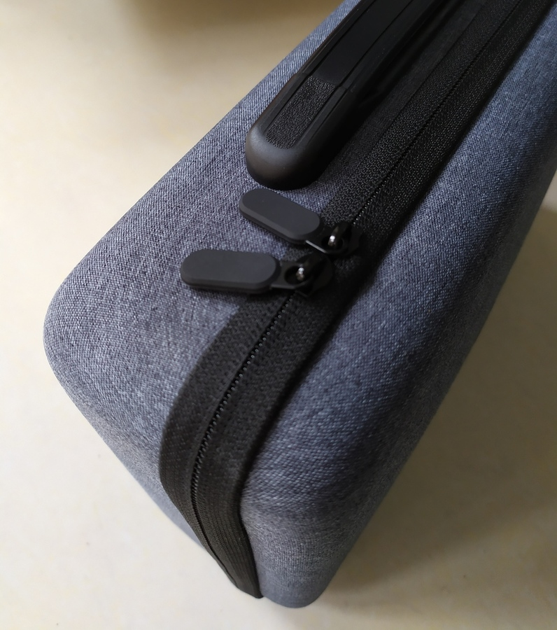

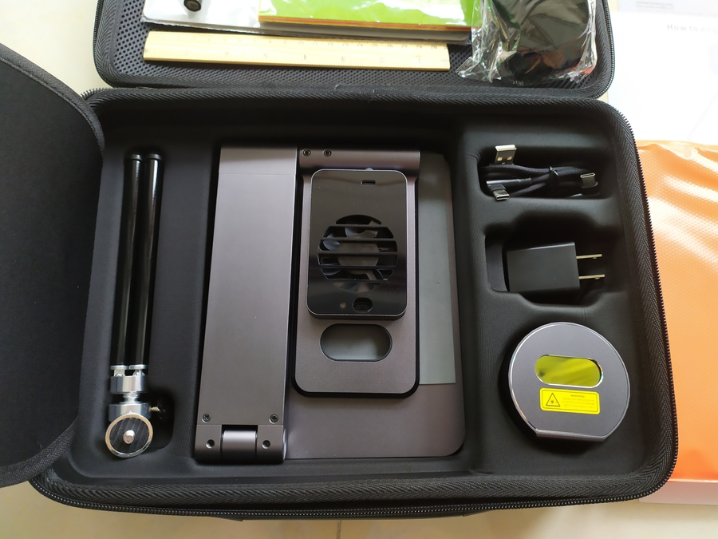

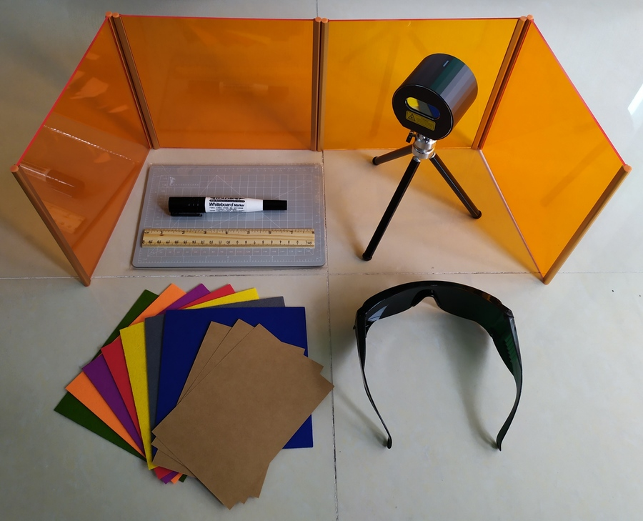

*What came in the Deluxe Edition*:
* Laser engraver
* USB power adapter (5V 2A)
* A pair of protective Goggles
* Engraving material pack
* A 20cm ruler
* A black whiteboard marker
* A cutting mat
* USB Cables (1 long, 1 short)
* A small foldable tripod
* Automatic stand
* 4 pieces of magnetic protective shields
* A hard carry case

## Control

Controlling the engraver is done via LaserPecker App and bluetooth. I do wish there's a desktop (Linux particularly) client or API available, as I'm a big fan of automation via scripting.

## Power Consumption & Heat Dissipation

## Speed & Configuration

## Accuracy Test

## Manipulation via Gcode

### Gray Scale & Cutting

## Working with Different Materials

### Wood

### Cardboard

### Plastic

### Fabric

### Coloured Paper

### Felt Paper
I have cut these for my son to play with. I used (80,60)x2 for a clean cut that's reasonably easy to remove. Occasionally, I had to use utility knife to cut part of the shape off.

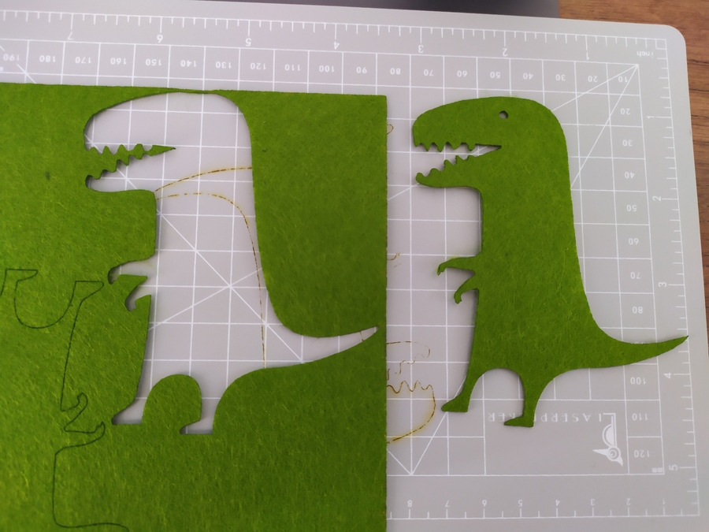
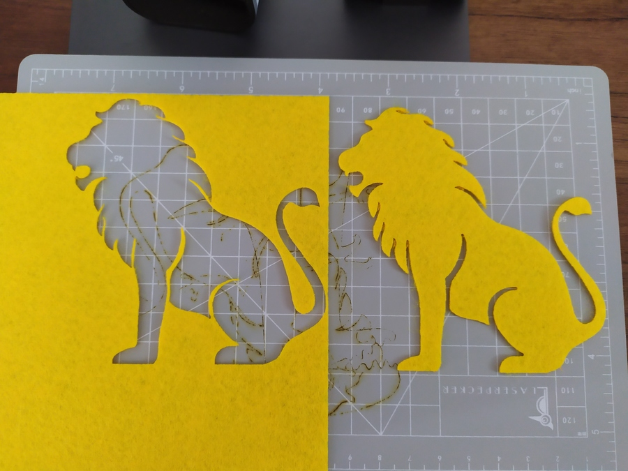

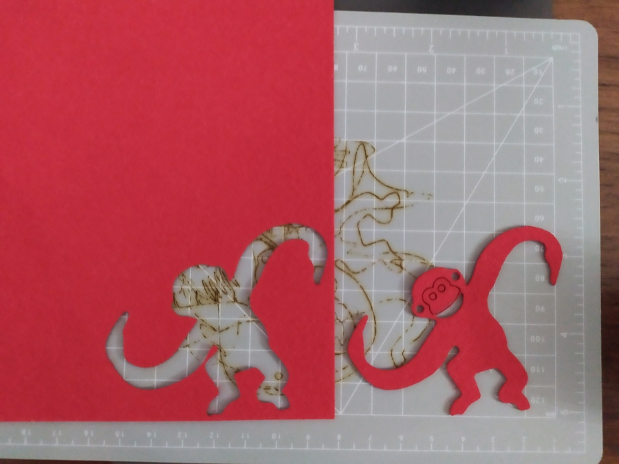

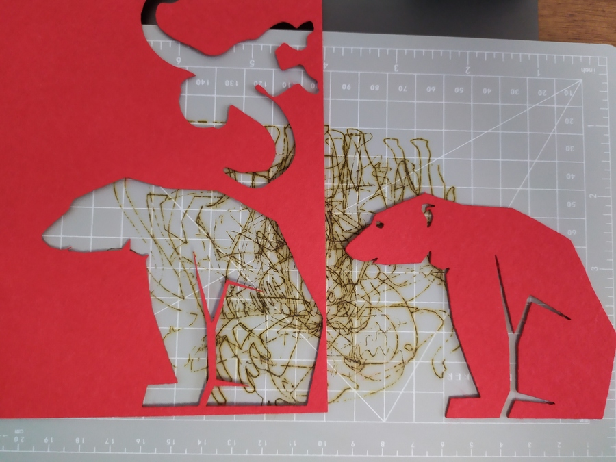
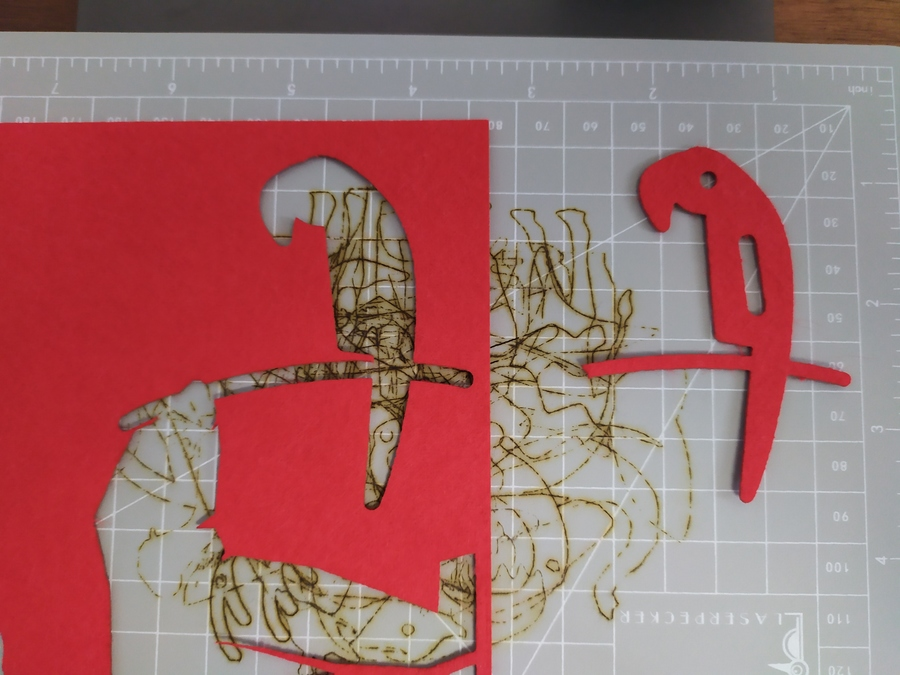

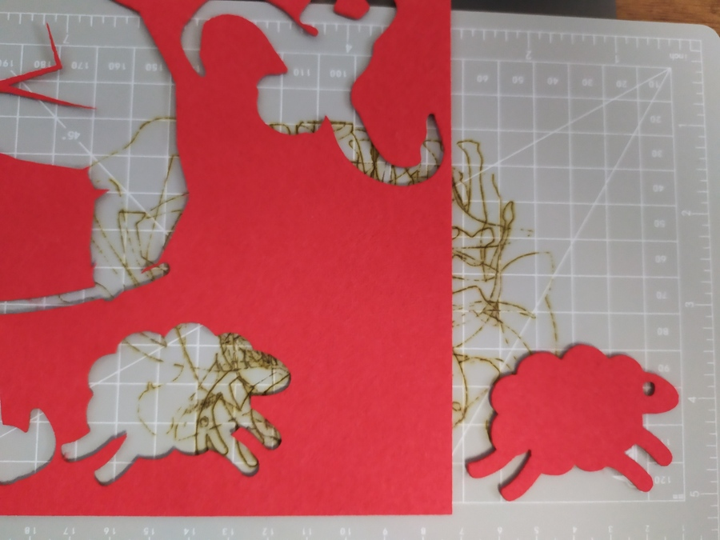
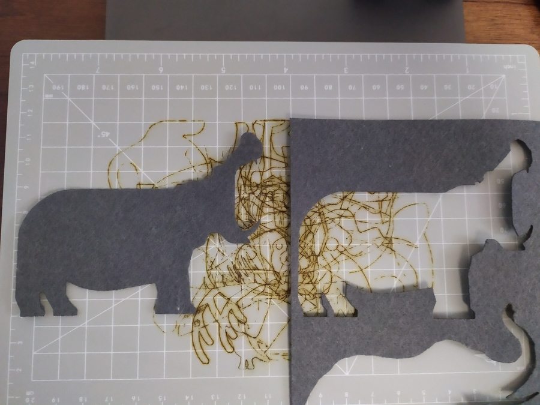
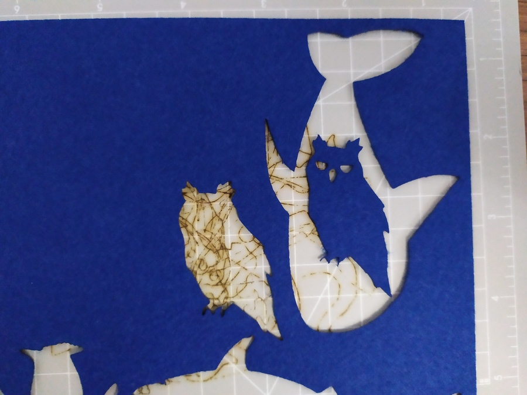
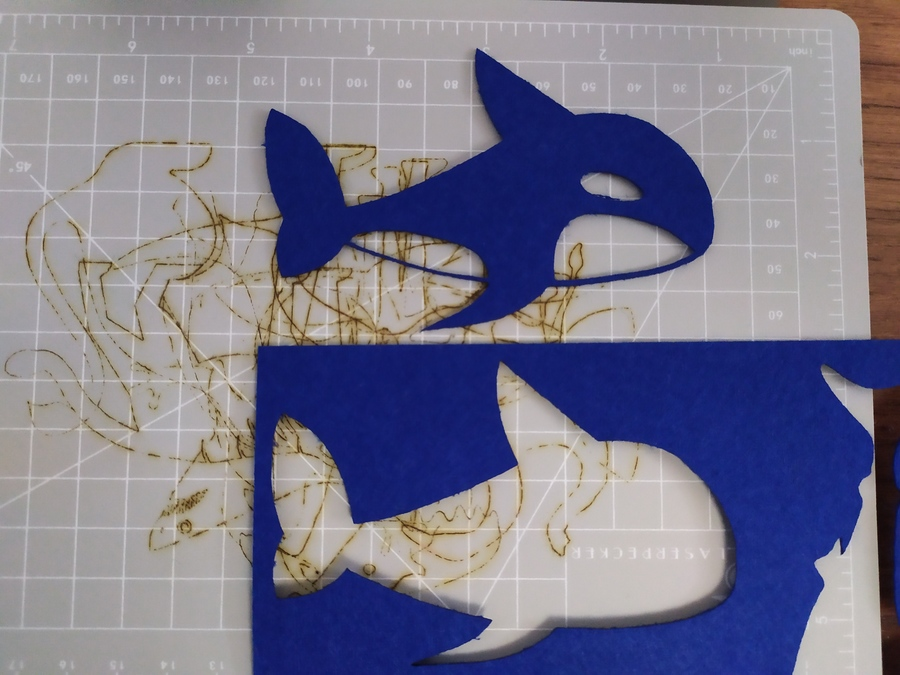

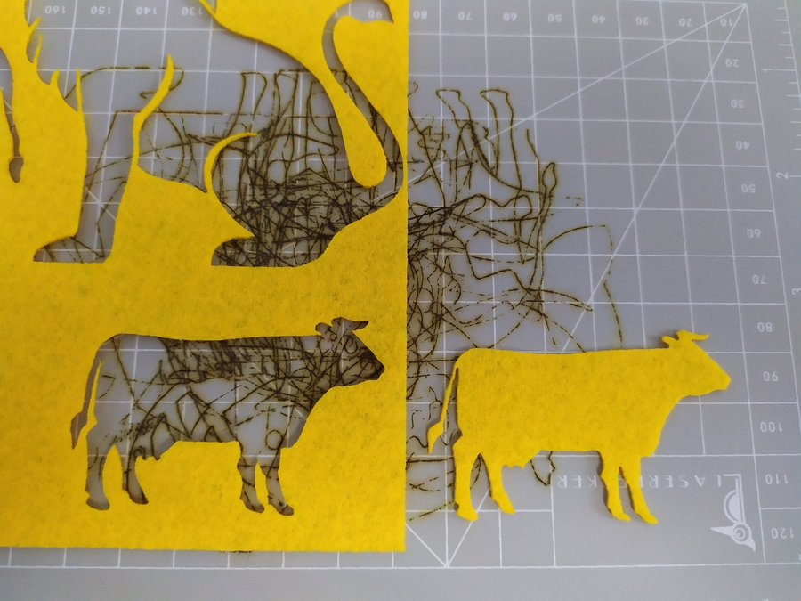
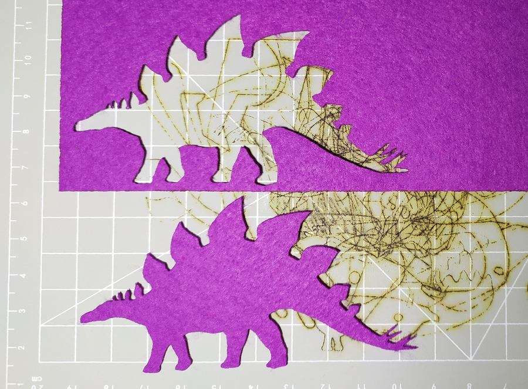
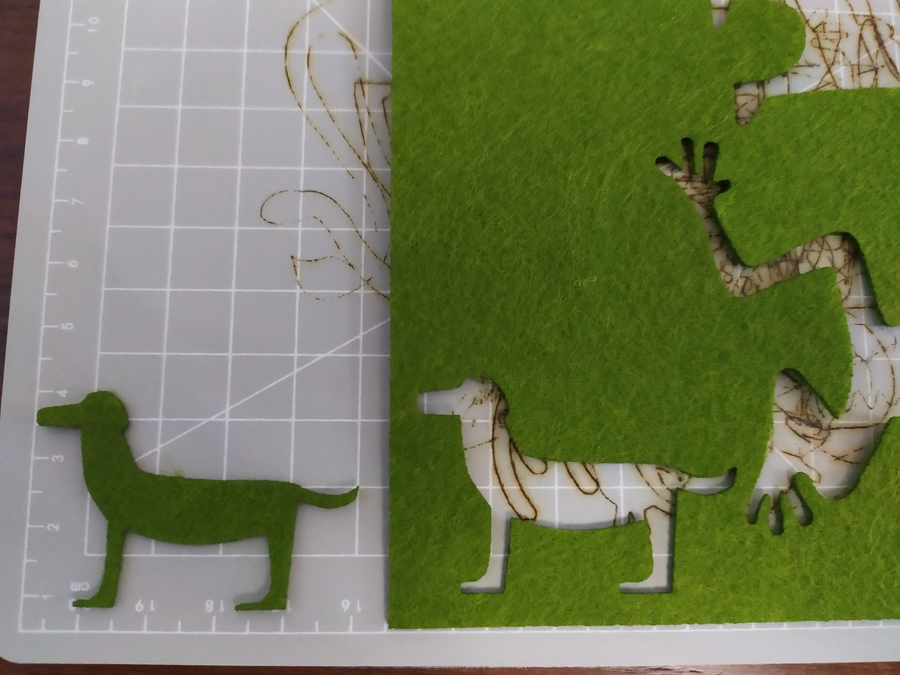

### Photosensitive Stamp

# Automatic Stand

The automatic stand was released with the Pro model. It is compatible with L1 and can be purchased separately.
